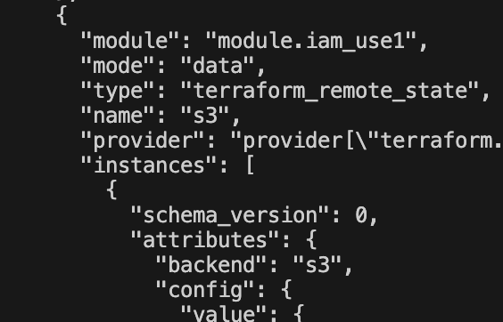
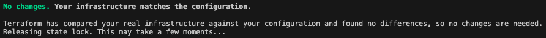

# Remote State Management

When using tools like **Terraform** to manage infrastructure, Terraform maintains a record of all created resources in a file called the **state file** (`terraform.tfstate`).  
This file contains metadata and mappings of your cloud resources (such as EC2 instances, VPCs, and S3 buckets), allowing Terraform to understand the current infrastructure and apply accurate updates or deletions.

By default, Terraform stores this state **locally** on your machine.  
However, in collaborative or automated environments (such as CI/CD pipelines), local state storage can lead to **inconsistencies, drift, and conflicts** between users or systems.

To address these issues, Terraform supports **remote state management**.

:::note
Remote state is especially critical when using CI/CD (e.g., GitHub Actions, Jenkins, or Terraform Cloud) for automation. These systems often run in parallel — without remote state locking, they could overwrite each other’s state changes.
:::

---
## What Is Remote State Management?

**Remote state management** is the practice of storing Terraform’s state file in a **shared, remote backend** instead of locally.  
This approach ensures a **single source of truth** for your infrastructure and provides several key advantages:

- **Collaboration** – Enables multiple users and CI/CD pipelines to safely share and modify the same Terraform state.
- **State Locking** – Prevents concurrent Terraform operations from corrupting the state (e.g., using DynamoDB or S3 Object Lock).
- **Backup & Security** – Remote backends (like S3) provide versioning, encryption, and durability for your state files.
- **Automation Ready** – Ensures Terraform runs consistently across environments and systems.


---

## Remote Backend Infrastructure Setup

Before Terraform can store its state remotely, you must provision a backend that provides both persistent storage and a locking mechanism to prevent concurrent operations.

In this setup, the Terraform state is stored in an AWS S3 bucket configured with versioning, encryption, and restricted public access. The bucket also uses S3 Object Lock, which ensures immutability and provides basic protection against concurrent writes, reducing the risk of accidental overwrites or deletions—without requiring a DynamoDB table.

:::note
While S3 Object Lock offers lightweight protection, DynamoDB remains the preferred choice for production-grade Terraform state locking.
DynamoDB provides explicit lock coordination, visibility, and safe concurrency handling, making it more suitable for environments where multiple users or CI/CD pipelines interact with the same Terraform state.
:::

### Provisioning the Remote State Infrastructure

The following Terraform configuration provisions the necessary S3 bucket for remote state storage.

##### 📁 <i>backend/main.tf</i>

```hcl
resource "aws_s3_bucket" "remote_state" {
  bucket = "mc-remote-state"

  lifecycle {
    prevent_destroy = true
  }
}
```

- Creates an S3 bucket named `mc-remote-state` 
- The `prevent_destroy` lifecycle rule prevents accidental deletion of the bucket.

```hcl
resource "aws_s3_bucket_versioning" "remote_state" {
	bucket = aws_s3_bucket.remote_state.id
	
	versioning_configuration {
		status = "Enabled"
	}
}
```

- Enables **versioning** for the bucket, preserving historical versions of the `terraform.tfstate` file.
- Facilitates recovery from accidental overwrites or deletions


```hcl
resource "aws_s3_bucket_server_side_encryption_configuration" "remote_state" {
	bucket = aws_s3_bucket.remote_state.id	
	
	rule {
		apply_server_side_encryption_by_default {
			sse_algorithm = "aws:kms"
		}
	}
}
```

- Applies **KMS-based encryption** to all objects stored in the bucket.
- Ensures that Terraform state files are **encrypted at rest**.

```hcl
resource "aws_s3_bucket_public_access_block" "remote_state" {

	bucket = aws_s3_bucket.remote_state.id  
	
	block_public_acls = true
	block_public_policy = true
	ignore_public_acls = true
	restrict_public_buckets = true
}
```

- Completely **blocks public access** to the bucket.
- Prevents unauthorized read or write operations from public users.

---
### Configuring Terraform to Use the Remote Backend

Once the S3 bucket (`mc-remote-state`) is provisioned, Terraform can be configured to store its state there by defining the backend in the root configuration file.

##### 📁 <i>env/dev/main.tf</i>

```hcl
terraform {
	required_providers {
		aws = {
			source = "hashicorp/aws"
			version = "~> 6.0"
		}
	}
	backend "s3" {
		bucket = "mc-remote-state"
		key = "dev/terraform.tfstate"
		region = "us-east-1"	
		use_lockfile = true
	}
}
```

#### Backend Configuration Parameters
- *bucket* - Name of the S3 bucket where the state file is stored
- *key* - Path within the bucket for the specific state file (e.g., `dev/terraform.tfstate`)
- *region* - AWS region where the S3 bucket is located
- *use_lockfile* - Enables a lock file to prevent concurrent Terraform operations. Defaults to `false`.

:::tip
It’s best practice to define your remote backend in the environment-level configuration (e.g., `env/dev/`, `env/prod/`) rather than in shared module directories, to maintain environment isolation.
:::

---

## Testing Remote Backend Setup

:::important
- The S3 bucket must already exist before running terraform init. Terraform won’t automatically create the bucket when defining a backend.
- If multiple regions or environments are being managed, use separate keys (e.g., `dev/terraform.tfstate`, `prod/terraform.tfstate`) and enable versioning to track state evolution per environment.
- Always re-run terraform init after adding or changing the backend block — Terraform needs to reconfigure its connection to the remote state.
:::

To verify that the remote backend is configured correctly, run the following commands:

```bash
terraform init
terraform plan
terraform state pull
```

Output should display the remote JSON state file contents — confirming it’s stored in S3.

Output:



Running `terraform plan` and `terraform apply` should also show that state locks are in use.

Output:


---
## Reference

- **Github:** [Remote Infrastructure Provisioning](https://github.com/deeowemez/minicommerce/blob/main/infra/backend/main.tf)
