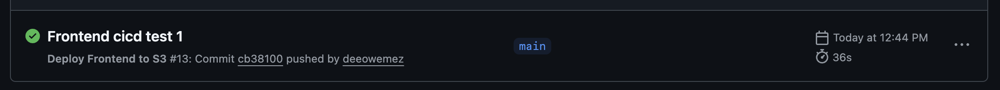

# Continuous Integration/Continuous Delivery

**Continuous Integration and Continuous Deployment (CI/CD)** is an automated process that builds, tests, and deploys code changes to production efficiently and reliably. **GitHub Actions** can be used to deploy frontend assets directly to an **Amazon S3** bucket using **OpenID Connect (OIDC)** for authentication. 

By using OIDC, the workflow securely obtains temporary AWS credentials at runtime, removing the need to store permanent access keys in GitHub and ensuring a more secure deployment process.

---
### 1. Configure AWS IAM for GitHub OIDC Authentication
#### a. Create the OIDC Identity Provider in AWS IAM
This provider allows AWS to trust tokens issued by GitHub’s OIDC service.

```
resource "aws_iam_openid_connect_provider" "github" {
  url            = "https://token.actions.githubusercontent.com"
  client_id_list = ["sts.amazonaws.com"]
}
```
- Establishes trust between AWS IAM and GitHub Actions.
- Enables the `sts:AssumeRoleWithWebIdentity` flow for secure, short-term credentials.

#### b. Define IAM Policies and Trust Relationship
##### Retrieve Remote State (optional)

If this IAM configuration depends on outputs from another Terraform stack (e.g., backend state), reference it via a remote state data block.

```
data "terraform_remote_state" "s3" {
  backend = "s3"

  config = {
    bucket = var.db_remote_state_bucket
    key    = var.db_remote_state_key
    region = var.aws_region
  }
}
```
##### Create IAM Policy for S3 Access
```
data "aws_iam_policy_document" "allow_s3_for_ci_cd" {
  statement {
    sid = "AllowCICDToAccessS3Bucket"
    actions = [
      "s3:PutObject",
      "s3:ListBucket",
      "s3:DeleteObject"
    ]
    resources = [
      var.frontend_bucket_arn,
      "${var.frontend_bucket_arn}/*",
    ]
  }
}
```
- Allows the workflow to upload (`PutObject`), list, and delete files in the target S3 bucket.
- Restricts permissions to the specific frontend bucket only.
##### Create the Trust Policy for GitHub Actions

This policy allows GitHub to assume the IAM role using OIDC, limited to a specific repository.

```
data "aws_iam_policy_document" "assume_ci_cd_role" {
  statement {
    sid     = "AllowCICDServiceAssumeRole"
    actions = ["sts:AssumeRoleWithWebIdentity"]

    principals {
      type        = "Federated"
      identifiers = [aws_iam_openid_connect_provider.github.arn]
    }

    condition {
      test     = "StringEquals"
      variable = "token.actions.githubusercontent.com:aud"
      values   = ["sts.amazonaws.com"]
    }

    condition {
      test     = "StringLike"
      variable = "token.actions.githubusercontent.com:sub"
      values   = ["repo:deeowemez/minicommerce:*"]
    }
  }
}
```
- Grants GitHub Actions permission to assume this role only if the request:
    - Comes from the repository `deeowemez/minicommerce`
    - Targets AWS STS (`aud = sts.amazonaws.com`)        
- Prevents unauthorized repositories from assuming the role.

##### Create the IAM Role and Attach Policy
```
resource "aws_iam_role" "allow_s3_for_ci_cd" {
  name               = "AllowS3ForCICDRole"
  assume_role_policy = data.aws_iam_policy_document.assume_ci_cd_role.json
}

resource "aws_iam_role_policy" "allow_s3_for_ci_cd" {
  name   = "AllowS3ForCICDPolicy"
  role   = aws_iam_role.allow_s3_for_ci_cd.id
  policy = data.aws_iam_policy_document.allow_s3_for_ci_cd.json
}
```
- The role `AllowS3ForCICDRole` is what GitHub Actions will assume.
- The inline policy grants S3 permissions scoped to the target bucket.

---
### 2. Configure GitHub Repository
Once the IAM role is created, configure GitHub to use it for deployments.

#### a. Add AWS Role ARN to GitHub Secrets

In your **GitHub repository**:
1. Go to **Settings → Secrets and variables → Actions**
2. Click **New Repository Secret**
3. Add the following secrets:
    - `FRONTEND_CICD_ROLE` → The ARN of the IAM role created (e.g., `arn:aws:iam::598558968737:role/AllowS3ForCICDRole`)

#### b. Update the GitHub Actions Workflow

Create or edit `.github/workflows/deploy_s3.yml` to use the OIDC role and deploy to S3.
```
name: Deploy Frontend to S3

on:
  push:
    paths:
      - 'frontend/**'
    branches:
      - main 
  workflow_dispatch:

permissions:
  id-token: write
  contents: read

jobs:
  deploy:
    environment: dev
    name: Build and Deploy
    runs-on: ubuntu-latest

    steps:
      - name: Checkout repository
        uses: actions/checkout@v4

      - name: Setup Node.js
        uses: actions/setup-node@v4
        with:
          node-version: '20'
          cache: 'npm'
          cache-dependency-path: frontend/package-lock.json

      - name: Install dependencies
        run: npm ci
        working-directory: frontend

      - name: Build project
        run: npm run build
        working-directory: frontend
        env:
          VITE_API_BASE_URL: ${{ vars.VITE_API_BASE_URL }}
          VITE_FIREBASE_API_KEY: ${{ secrets.VITE_FIREBASE_API_KEY }}
          VITE_FIREBASE_AUTH_DOMAIN: ${{ vars.VITE_FIREBASE_AUTH_DOMAIN }}
          VITE_FIREBASE_PROJECT_ID: ${{ vars.VITE_FIREBASE_PROJECT_ID }}
          VITE_FIREBASE_STORAGE_BUCKET: ${{ vars.VITE_FIREBASE_STORAGE_BUCKET }}
          VITE_FIREBASE_MESSAGING_SENDER_ID: ${{ vars.VITE_FIREBASE_MESSAGING_SENDER_ID }}
          VITE_FIREBASE_APP_ID: ${{ vars.VITE_FIREBASE_APP_ID }}
          VITE_FIREBASE_MEASUREMENT_ID: ${{ vars.VITE_FIREBASE_MEASUREMENT_ID }}

      - name: Configure AWS credentials
        uses: aws-actions/configure-aws-credentials@v4
        with:
          role-to-assume: ${{ vars.FRONTEND_CICD_ROLE }}
          aws-region: us-east-1

      - name: Sync build files to S3
        run: aws s3 sync frontend/dist s3://minicommerce-use1-static-25 --delete
      
      - name: Confirm upload
        run: aws s3 ls s3://minicommerce-use1-static-25 --recursive --human-readable --summarize
```
- Uses **OpenID Connect (OIDC)** authentication (`id-token: write`) to obtain temporary AWS credentials securely.
- Assumes the configured **IAM role** without requiring long-term AWS access keys.
- Builds the frontend using **Node.js 20**, pulling environment variables and secrets from GitHub.
- Deploys the compiled static files from the `/frontend/dist` directory to the target **S3 bucket**, ensuring synchronization with the latest build.
- Verifies successful deployment by listing uploaded files in the S3 bucket.

---
### 3. Test the CI/CD Deployment

To confirm the pipeline works correctly:
1. **Commit and push** a change to the `main` branch (e.g., update a small frontend file).
2. In GitHub, open **Actions → Frontend Deployment** to monitor the workflow run.
3. Verify workflow run is successful:



4. Go to the **S3 bucket** in AWS Console and confirm new/updated files exist.
5. Visit your **CloudFront distribution URL** to verify the latest changes are live.


---
## Reference

- **Github Scripts:** [IAM module script](https://github.com/deeowemez/minicommerce/blob/main/infra/modules/iam/main.tf) | [Frontend CI/CD Workflow](https://github.com/deeowemez/minicommerce/blob/main/.github/workflows/deploy_s3.yml)
